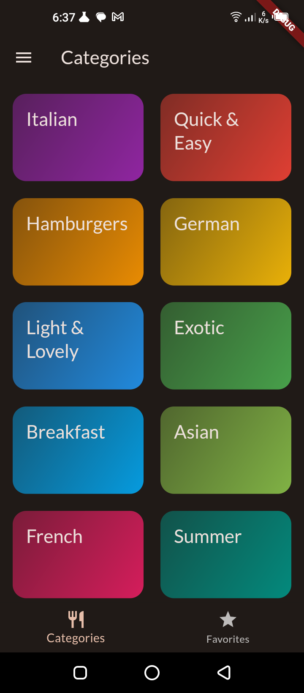
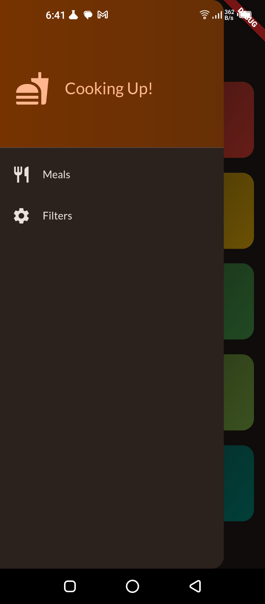
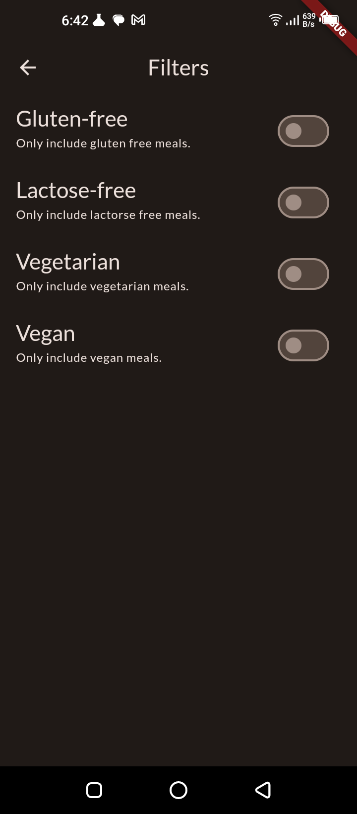
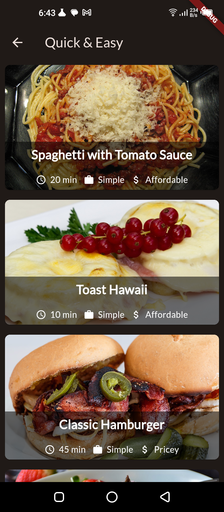
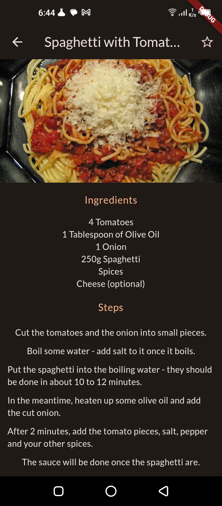
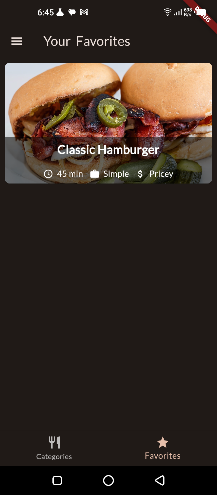

# MEALS APP
_A **guided project** to learn differnt widgets, state management, animations and and overall app architecture in flutter. **Following udemy course [Flutter & Dart - The Complete Guide](https://www.udemy.com/course/learn-flutter-dart-to-build-ios-android-apps/) by Maximillian Schwarzmüller**.
The original project source code can be found [here](https://github.com/academind/flutter-complete-guide-course-resources/tree/main/Code%20Snapshots/10%20Animations/05%20Finished)._

**Introduction**:<br>
MEALS is a versatile Flutter app powered by RiverPod for state management. It enables users to explore, manage, and filter meals, including dietary preferences like vegan, vegetarian, and gluten-free. The app offers a user-friendly experience with a bottom tab bar and a side drawer for filter access. It's fully responsive on Android and iOS.

**Disclaimer**:
 - This project was for learning purposes.
 - It is not a replica of Maximillian's actuall project, which you can find <a href = 'https://github.com/academind/flutter-complete-guide-course-resources/tree/main/Code%20Snapshots/10%20Animations/05%20Finished'>here</a>

# Table of Contents
- [Features](#features)
- [Project Structure](#project-structure)
- [Dependencies](#dependencies)
- [Screenshots](#screenshots)
- [Getting Started](#getting-started)

# Features

- **State Management**: The app uses RiverPod for state management. The app state is managed using providers, and the UI is updated using Consumer widgets.
    ```dart
    // Provider
    final favoriteMealsProvider = ChangeNotifierProvider((ref) => FavoriteMeals());
    ```
    ```dart
    // Consumer
    Consumer(
        builder: (context, watch, child) {
            final favoriteMeals = watch(favoriteMealsProvider);
            return IconButton(
                onPressed: () {
                    favoriteMeals.toggleFavorite(mealId);
                },
                icon: Icon(
                    favoriteMeals.isFavorite(mealId)
                        ? Icons.star
                        : Icons.star_border,
                ),
            );
        },
    );
    ```
- **Animations**: The app uses animations for screen transitions, and for the favorite button.
    ```dart
    // Screen transition animation
    Navigator.of(context).push(
        PageRouteBuilder(
            transitionDuration: Duration(milliseconds: 500),
            pageBuilder: (context, animation, _) {
                return FadeTransition(
                    opacity: animation,
                    child: CategoriesScreen(),
                );
            },
        ),
    );
    ```
    ```dart
    // Favorite button animation
    AnimatedBuilder(
        animation: _controller,
        builder: (context, child) {
            return IconButton(
                onPressed: () {
                    _toggleFavorite(mealId);
                },
                icon: Icon(
                    _isFavorite ? Icons.star : Icons.star_border,
                ),
                color: Theme.of(context).accentColor.withOpacity(_controller.value),
            );
        },
    );
    ```


# Project Structure
The project structure is organized as follows:
```yaml
meals
  lib:
    data:
      dummy_data.dart
    models:
      category.dart
      meal.dart
    providers:
      favorite_meals.dart
    screens:
      categories_screen.dart
      category_meals_screen.dart
      meal_detail_screen.dart
      tabs_screen.dart
      filters_screen.dart
    widgets:
      category_item.dart
      main_drawer.dart
      meal_item.dart
    main.dart
  pubspec.yaml
  README.md
```
# Dependencies
The project relies on the following dependencies:
```yaml
dependencies:
  flutter:
    sdk: flutter
  cupertino_icons: ^1.0.2
  google_fonts: ^5.1.0
  transparent_image: ^2.0.1
  flutter_riverpod: ^2.4.0
```
# Getting Started
To get started with this project, follow these steps:
1. Clone the project to your local machine.
    ```bash
    git clone https://github.com/khayyam-ahmed/meals.git
    ```
2. Install all of the project dependencies
    ```bash
    flutter pub get
    ```
3. Run the app on your device or emulator:
    ```bash
    flutter run
    ```
Now you're ready to go. 🥳🥳🥳

Feel free to customize the app further according to your needs.

Happy coding!
# Screenshots
<style>
* {
  box-sizing: border-box;
}

.column {
  float: left;
  width: 33.33%;
  padding: 5px;
}

/* Clearfix (clear floats) */
.row::after {
  content: "";
  clear: both;
  display: table;
}
</style>
<div class="row">
  <div class="column">
    <h2 style="text-align:center">Categories Screen</h2>
    
  </div>
  <div class="column">
    <h2 style="text-align:center">Main_Drawer</h2>
    
  </div>
  <div class="column">
    <h2 style="text-align:center">Filters Screen</h2>
    
  </div>
</div>

<div class="row">
  <div class="column">
    <h2 style="text-align:center">Meals Screen</h2>
    
  </div>
  <div class="column">
    <h2 style="text-align:center">Meal Details Screen</h2>
    
  </div>
  <div class="column">
    <h2 style="text-align:center">Favorites Screen</h2>
    
  </div>
</div>


# Credits
- [Maximillian Schwarzmüller](https://www.udemy.com/user/maximilian-schwarzmuller/)